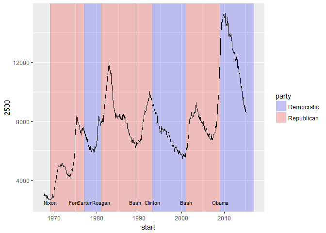
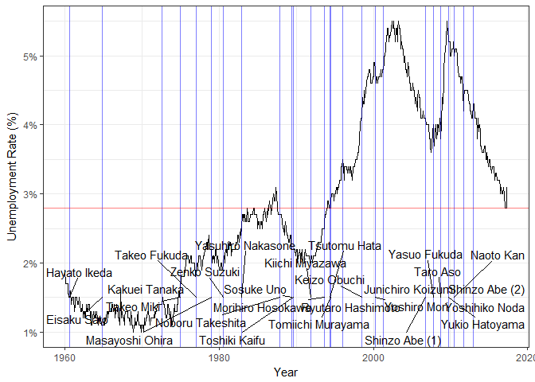
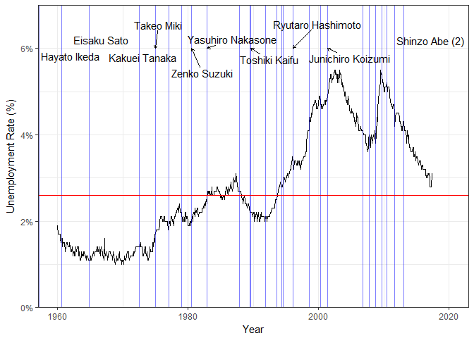

Simple graphing with ggplot2.
-----------------------------

I was flipping through Hadley Wickham's *ggplot2* book the other day when I came across this:



Which shows the unemployment data for the USA from 1967 to 2015 along with the Presidents in power during those periods (and their respective political parties). A very simple but poignant graph that (with added historical narrative) can tell us a lot about different stories about the US economy and the politics driving them! Motivated by this I set out to make a similar graph but with data from my birth country, Japan.

For the unemployment data, I was able to download a dataset from the [Federal Reserve Bank of St. Louis](https://fred.stlouisfed.org/series/LRHUTTTTJPM156S) website. It's a really fantastic source with loads of raw data from around the world that you can download (in Excel, .csv, .png, PowerPoint, and .pdf formats), I will definitely be coming back here for other articles! This dataset comprises of the harmonized monthly unemployment rate for ALL person for Japan. There was another dataset for Aged 15-64 however that one only went back to January of 1970. I wanted to go back to 1960 (or better 1945) for a better look at Japan's post-war economic history and recovery so I went with this one instead. For a more in-depth analysis I would hunt down some Japanese sources but for today we are just focusing on the simple **ggplot2** graph.

For the dataset about the Prime Ministers of Japan I went to Wikipedia, a source that's pretty reliable and easy to use. Normally, I would web-scrape the information using **rvest** however, I did not know how to scrap multiple tables at once (as the Prime Ministers were divided into individual tables according to the reigning Emperor) so I created it manually. Thankfully this didn't take too long!

``` r
prime_ministers <- data.frame(
  name = c("Tetsu Katayama", "Hitoshi Ashida", "Shigeru Yoshida", "Ichiro Hatoyama", "Tanzan Ishibashi",
           "Nobusuke Kishi", "Hayato Ikeda", "Eisaku Sato", "Kakuei Tanaka", "Takeo Miki",
           "Takeo Fukuda", "Masayoshi Ohira", "Zenko Suzuki", "Yasuhiro Nakasone", "Noboru Takeshita",
           "Sosuke Uno", "Toshiki Kaifu", "Kiichi Miyazawa", "Morihiro Hosokawa", "Tsutomu Hata",
           "Tomiichi Murayama", "Ryutaro Hashimoto", "Keizo Obuchi", "Yoshiro Mori", "Junichiro Koizumi",
           "Shinzo Abe (1)", "Yasuo Fukuda", "Taro Aso", "Yukio Hatoyama", "Naoto Kan",
           "Yoshihiko Noda", "Shinzo Abe (2)"),
  
  start = as.Date(c("1947-05-24", "1948-03-10", "1948-10-15", "1954-12-10", "1956-12-23",
                    "1957-02-25", "1960-07-19", "1964-11-09", "1972-07-07", "1974-12-09",
                    "1976-12-24", "1978-12-07", "1980-07-17", "1982-11-27", "1987-11-06",
                    "1989-06-03", "1989-08-10", "1991-11-05", "1993-08-09", "1994-04-28",
                    "1994-06-30", "1996-01-11", "1998-06-30", "2000-04-05", "2001-04-26",
                    "2006-09-26", "2007-09-26", "2008-09-24", "2009-09-16", "2010-06-08",
                    "2011-09-02", "2012-12-26")),
  
  end = as.Date(c("1948-03-10", "1948-10-15", "1954-12-10", "1956-12-23", "1957-02-25",
                  "1960-07-19", "1964-11-09", "1972-07-07", "1974-12-09", "1976-12-24",
                  "1978-12-07", "1980-07-17", "1982-11-27", "1987-11-06", "1989-06-03",
                  "1989-08-10", "1991-11-05", "1993-08-09", "1994-04-28", "1994-06-30",
                  "1996-01-11", "1998-06-30", "2000-04-05", "2001-04-26", "2006-09-26",
                  "2007-09-26", "2008-09-24", "2009-09-16", "2010-06-08", "2011-09-02",
                  "2012-12-26", "2017-01-01")),
  stringsAsFactors = FALSE
)
```

With that out of the way we can load the unemployment data set and set about tidying out the raw data.

``` r
# load data ---------------------------------------------------------------
japan_unemploy <- read.csv("~/R_materials/Misc.ProjectsTutorials/japan_pm/LRUNTTTTJPM156S.csv", 
                           header = TRUE, stringsAsFactors = FALSE)
library(tibble)
glimpse(japan_unemploy)   # glimpse() is similar to using str() but tidier
```

    ## Observations: 689
    ## Variables: 2
    ## $ DATE            <chr> "1960-01-01", "1960-02-01", "1960-03-01", "196...
    ## $ LRUNTTTTJPM156S <dbl> 1.9, 1.7, 1.7, 1.7, 1.7, 1.6, 1.5, 1.6, 1.6, 1...

We can see here that the dates are in character format and that the column names are in all caps. We can convert the dates using the `as.Date()` function included in base R and change the column names to lower case using the `str_lower()` function from the **stringr** package:

``` r
library(stringr)

japan_unemploy$DATE <- as.Date(japan_unemploy$DATE, format = "%Y-%m-%d")

colnames(japan_unemploy) <- japan_unemploy %>% 
  colnames() %>% 
  str_to_lower()

glimpse(japan_unemploy)
```

    ## Observations: 689
    ## Variables: 2
    ## $ date            <date> 1960-01-01, 1960-02-01, 1960-03-01, 1960-04-0...
    ## $ lrunttttjpm156s <dbl> 1.9, 1.7, 1.7, 1.7, 1.7, 1.6, 1.5, 1.6, 1.6, 1...

Now, we need to change the column name for the unemployment data to something more reasonable:

``` r
japan_unemploy <- japan_unemploy %>% rename(unemployed = lrunttttjpm156s)

glimpse(japan_unemploy)
```

    ## Observations: 689
    ## Variables: 2
    ## $ date       <date> 1960-01-01, 1960-02-01, 1960-03-01, 1960-04-01, 19...
    ## $ unemployed <dbl> 1.9, 1.7, 1.7, 1.7, 1.7, 1.6, 1.5, 1.6, 1.6, 1.4, 1...

``` r
glimpse(prime_ministers)
```

    ## Observations: 32
    ## Variables: 3
    ## $ name  <chr> "Tetsu Katayama", "Hitoshi Ashida", "Shigeru Yoshida", "...
    ## $ start <date> 1947-05-24, 1948-03-10, 1948-10-15, 1954-12-10, 1956-12...
    ## $ end   <date> 1948-03-10, 1948-10-15, 1954-12-10, 1956-12-23, 1957-02...

Fantastic! Now we have two tidied data sets that we can use for our graph.

Let's start plotting!

Here we use **ggrepel** package to prevent the labels from overlapping. `geom_vline()` and `geom_hline()` are used to create custom vertical and horizontal lines on the starting and ending dates of each Prime Minister's term and for the mean unemployment rate respectively.

``` r
library(ggrepel)  # to help with overlapping labels
library(scales)   # to help format scales and labels

japan_unemploy %>% 
  ggplot() +
  geom_line(
    aes(date, unemployed/100)
    ) +
  geom_vline(
    data = prime_ministers, 
    aes(xintercept = as.numeric(start)),
    color = "blue", alpha = 0.5
    ) +
  geom_text_repel(
    data = prime_ministers %>% filter(start > japan_unemploy$date[1]),
    aes(x = start, y = 0.015, label = name)
    ) +
  scale_y_continuous(
    labels = percent_format()
    ) +
  geom_hline(
    yintercept = mean(japan_unemploy$unemployed/100), color = "red", alpha = 0.5
    ) +
  labs(
    x = "Year", y = "Unemployment Rate (%)"
    ) +
  theme_bw()
```



Looking at this graph, even with using `geom_text_repel()` there are too many Prime Ministers for it to look nice. This speaks for the highly turbulent "revolving door" of politics in Japan, especially in times of economic downturns such as in the 1990s and early 2000s (although many were caught in unrelated scandals or other kerfluffles too...).

To unclutter our graph, let's only show Prime Ministers whose term exceeded 2 years (730 days to be exact).

``` r
(prime_ministers$end - prime_ministers$start) %>% head(8)   # only show results from first 8 rows
```

    ## Time differences in days
    ## [1]  291  219 2247  744   64 1240 1574 2797

By subtracting the starting dates from end dates we can calculate the length of each Prime Minister's term in days. The PM that lasted **64** days as shown is [Tanzan Ishibashi](https://en.wikipedia.org/wiki/Tanzan_Ishibashi), who unfortunately was incapacitated by stroke. Others such as [S&\#333suke Uno](https://en.wikipedia.org/wiki/S%C5%8Dsuke_Uno) (**68** days) resigned in more acrimonious terms (allegations of an extramarital affair with a **geisha** leading to a terrible performance in the subsequent election! Details can be read in *Secrets, Sex, and Spectacle: The Rules of Scandal in Japan and the United States* by Mark West if you're **really** curious).

Now we just have to use mutate() to add this data into a new column:

``` r
prime_ministers <- prime_ministers %>% mutate(pm_term = (end - start))
```

Now let's try plotting again:

``` r
# second try!

japan_unemploy %>% 
  ggplot() +
  geom_line(
    aes(date, unemployed/100)) +
  geom_vline(
    data = prime_ministers, 
    aes(xintercept = as.numeric(start)),
    color = "blue", alpha = 0.5) +
  scale_x_date(
    limits = as.Date(c("1960-01-01", "2020-01-01")),
    date_labels = "%Y"
  ) +
  geom_text_repel(
    data = prime_ministers %>% filter(start > japan_unemploy$date[1], pm_term > 730),
    aes(x = start, y = 0.06, label = name), 
    force = 15, arrow = arrow(length = unit(0.01, 'npc'))
  ) +
  scale_y_continuous(
    labels = percent_format(), 
    limits = c(0.0, 0.07),
    expand = c(0, 0)) +
  geom_hline(
    yintercept = median(japan_unemploy$unemployed/100), color = "red") +
  labs(
    x = "Year", y = "Unemployment Rate (%)") +
  theme_bw()
```



Much better! I wanted to fill in the spaces of the terms with the political parties, however, most of the Prime Ministers came from the Liberal Democratic Party or LDP (Jimintō in Japanese) which dominated Japanese politics from 1955 to all the way to 1993! Also with so many segments of PMs it wouldn't look as pretty as Hadley's graph.

Anyways, what I thought would be a quick practice turned out to take a lot longer as I had to fiddle with the aesthetics quite a bit to get everything juuust right. To finish off, I'll leave you with this article, [Japan's unemployment rate falls to 22-year low of 2.8% in Feb. 2017](https://www.japantimes.co.jp/news/2017/03/31/business/economy-business/joblessness-falls-22-year-low-2-8-february/). Under Shinzō Abe, unemployment has decreased significantly, but has it had positive impacts on the Japanese economy in other areas? That's a long debate for another article...!
